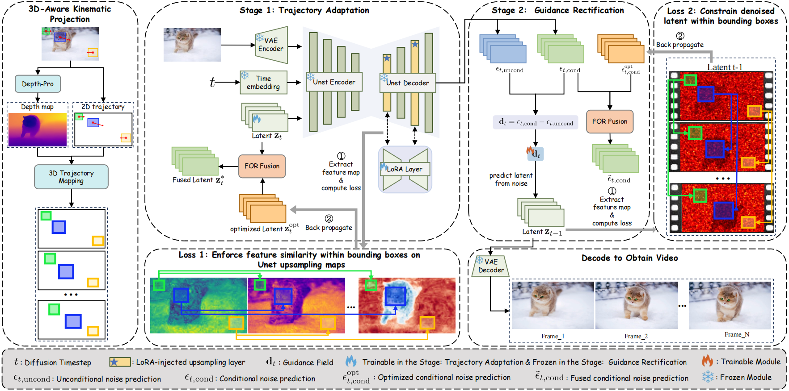

# Zo3T: Zero-shot 3D-Aware Trajectory-Guided Image-to-Video Generation via Test-Time Training

<p align="center">
  <strong>Ruicheng Zhang</strong><sup>1,2*</sup>,
  <strong>Jun Zhou</strong><sup>1*</sup>,
  <strong>Zunnan Xu</strong><sup>1*</sup>,
  <strong>Zihao Liu</strong><sup>1</sup>,
  <strong>Jiehui Huang</strong><sup>3</sup>,
  <strong>Mingyang Zhang</strong><sup>4</sup>,
  <strong>Yu Sun</strong><sup>2</sup>,
  <strong>Xiu Li</strong><sup>1†</sup>
</p>

<p align="center">
  <sub>
    <sup>1</sup> Tsinghua University, <sup>2</sup> Sun Yat-sen University<br>
    <sup>3</sup> The Hong Kong University of Science and Technology, <sup>4</sup> China University of Geosciences
  </sub>
</p>

<p align="center">
  <sub>* Equal contribution. † Corresponding author.</sub>
</p>

<p align="center">
  <a href="https://arxiv.org/abs/2509.06723"> ArXiv</a> | 
  <a href="https://richard-zhang-ai.github.io/"> Demo Page</a>
</p>

<h1 align="center">
  🎉 Our paper has been accepted to AAAI 2026! 🤖
</h1>

---

## Framework Overview



<p align="center">
  <small><i>
    An overview of our zero-shot trajectory-guided video generation framework.<br>
    Our method optimizes a pre-trained video diffusion model at specific denoising timesteps via two key stages.<br>
    <b>Test-Time Training (TTT)</b> adapts the latent state and an ephemeral adapter to maintain semantic consistency along the trajectory.<br>
    <b>Guidance Field Rectification</b> refines the denoising direction using a one-step lookahead optimization to ensure precise path execution.
  </i></small>
</p>

---

## Getting Started

### Prerequisites

To run Zo3T, ensure you have the following dependencies installed:

| Requirement                       | Description                                      |
|-----------------------------------|--------------------------------------------------|
| **Python**                        | Version 3.12                                     |
| **Pre-trained Model**             | Stable Video Diffusion model                     |

### Installation

Follow these steps to set up the environment and install dependencies.

#### 1. Clone the Repository

Clone the Zo3T repository to your local machine:

```bash
git clone https://github.com/your-username/Zo3T-main.git
cd Zo3T-main
```

#### 2. Create and Activate a Conda Environment

We recommend using `conda` to manage dependencies. Create and activate a new environment:

```bash
conda create -n zo3t python=3.12 -y
conda activate zo3t
```

#### 3. Install Dependencies

Install all required packages listed in `requirements.txt`:

```bash
pip install -r requirements.txt
```

#### 4. Download the Stable Video Diffusion Model

The pipeline requires the `stable-video-diffusion-img2vid` model checkpoint.

- Download it from the [official Hugging Face repository](https://huggingface.co/stabilityai/stable-video-diffusion-img2vid).
- Place the model folder in a convenient location.

Update the `svd_dir` variable in `inference.py` to point to the model directory:

```python
# in inference.py
# Load pre-trained image-to-video diffusion models
print("Loading Stable Video Diffusion from local path...")
svd_dir = "/path/to/your/stable-video-diffusion-img2vid"  # ⬅️ Update this path
```

You are now ready to run the inference script.

---

### Usage

Prepare your input directory with the following structure:

```
/path/to/your/input_dir/
├── img.png
└── traj.npy
```

- **`img.png`**: The first frame of the video.
- **`traj.npy`**: A NumPy array of shape `[N, (2+F), 2]`, where:
  - `N`: Number of objects to track.
  - First slice `[:, :2, :]`: Top-left and bottom-right coordinates `[[w1, h1], [w2, h2]]` of the initial bounding boxes.
  - Second slice `[:, 2:, :]`: Trajectory of the center point for each bounding box over `F` frames.

Run the inference script:

```bash
python inference.py --input_dir /path/to/your/input_dir/ --output_dir /path/to/your/output_dir/
```

---

### Configuration

Adjust hyperparameters in the `Config` class in `inference.py`:

- **`seed`**: Random seed for reproducibility.
- **`height`, `width`**: Resolution of the generated video.
- **`num_frames`**: Number of frames to generate.
- **`num_inference_steps`**: Total number of denoising steps.
- **`optimize_latent_time`**: List of timesteps for optimization.
- **`optimize_latent_iter`**: Number of optimization iterations per timestep.
- **`optimize_latent_lr`**: Learning rate for latent optimization.
- **`enable_lora`**: Set to `True` to use LoRA during optimization.
- **`enable_depth_scaling`**: Set to `True` to enable depth-aware trajectory scaling.
- **`enable_control_force_optimization`**: Set to `True` to enable control force optimization.

---

## Citation

If you find our work useful for your research, please consider citing our paper:

```bibtex
@inproceedings{zhang2026zo3t,
  title     = {Zo3T: Zero-shot 3D-Aware Trajectory-Guided Image-to-Video Generation via Test-Time Training},
  author    = {Zhang, Ruicheng and Zhou, Jun and Xu, Zunnan and Liu, Zihao and Huang, Jiehui and Zhang, Mingyang and Sun, Yu and Li, Xiu},
  booktitle = {Proceedings of the AAAI Conference on Artificial Intelligence (AAAI)},
  year      = {2026}
}
```
