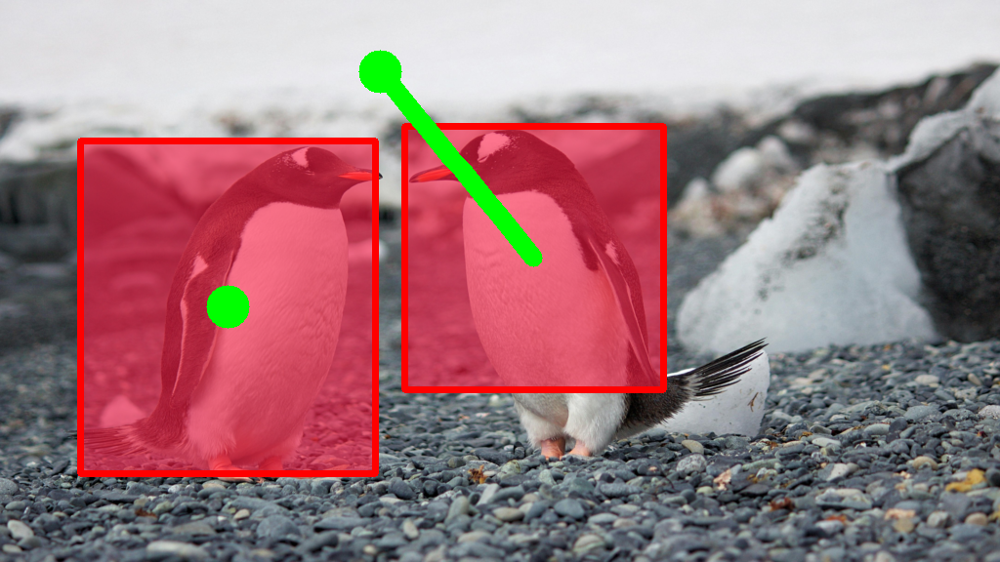

# Zo3T: Zero-shot 3D-Aware Trajectory-Guided image-to-video generation via Test-Time Training

<p align="center">
  <strong>Ruicheng Zhang</strong><sup>1,2*</sup>,
  <strong>Jun Zhou</strong><sup>1*</sup>,
  <strong>Zunnan Xu</strong><sup>1*</sup>,
  <strong>Zihao Liu</strong><sup>1</sup>,
  <strong>Jiehui Huang</strong><sup>3</sup>,
  <strong>Mingyang Zhang</strong><sup>4</sup>,
  <strong>Yu Sun</strong><sup>2</sup>,
  <strong>Xiu Li</strong><sup>1†</sup>

<p align="center"><sub>
  <sup>1</sup> Tsinghua University, <sup>2</sup> Sun Yat-sen University<br>
  <sup>3</sup> The Hong Kong University of Science and Technology, <sup>4</sup> China University of Mining and Technology
</sub></p>

<p align="center"><sub>* Equal contribution. † Corresponding author.</sub></p>

## Framework Overview


<p><small><i>
An overview of our zero-shot trajectory-guided video generation framework.
Our method optimizes a pre-trained video diffusion model at specific denoising timesteps via two key stages.
First, <b>Test-Time Training (TTT)</b> adapts the latent state and an ephemeral adapter to maintain semantic consistency along the trajectory.
Second, <b>Guidance Field Rectification</b> refines the denoising direction using a one-step lookahead optimization to ensure precise path execution.
</i></small></p>

## Results

<h3 align="center">Qualitative Results</h3>

<table>
  <tr>
    <td align="center" style="vertical-align: top; padding: 8px;">
      <div></div>
      <div style="margin-top: 6px;"><video src="asserts/videos/1-compare/Ours.mp4" width="220" controls muted loop autoplay playsinline></video></div>
    </td>
    <td align="center" style="vertical-align: top; padding: 8px;">
      <div></div>
      <div style="margin-top: 6px;"><video src="asserts/videos/2-compare/Ours.mp4" width="220" controls muted loop autoplay playsinline></video></div>
    </td>
    <td align="center" style="vertical-align: top; padding: 8px;">
      <div></div>
      <div style="margin-top: 6px;"><video src="asserts/videos/3/result.mp4" width="220" controls muted loop autoplay playsinline></video></div>
    </td>
    <td align="center" style="vertical-align: top; padding: 8px;">
      <div></div>
      <div style="margin-top: 6px;"><video src="asserts/videos/4/result.mp4" width="220" controls muted loop autoplay playsinline></video></div>
    </td>
  </tr>
  <tr>
    <td align="center" style="vertical-align: top; padding: 8px;">
      <div></div>
      <div style="margin-top: 6px;"><video src="asserts/videos/5/result.mp4" width="220" controls muted loop autoplay playsinline></video></div>
    </td>
    <td align="center" style="vertical-align: top; padding: 8px;">
      <div></div>
      <div style="margin-top: 6px;"><video src="asserts/videos/6/result.mp4" width="220" controls muted loop autoplay playsinline></video></div>
    </td>
    <td align="center" style="vertical-align: top; padding: 8px;">
      <div></div>
      <div style="margin-top: 6px;"><video src="asserts/videos/7/result.mp4" width="220" controls muted loop autoplay playsinline></video></div>
    </td>
    <td align="center" style="vertical-align: top; padding: 8px;">
      <div></div>
      <div style="margin-top: 6px;"><video src="asserts/videos/8/result.mp4" width="220" controls muted loop autoplay playsinline></video></div>
    </td>
  </tr>
  <tr><td colspan="4" align="center" style="padding:6px 0;"><span style="color:#6a737d"><b>(a) Object Control (1–8)</b></span></td></tr>
  <tr>
    <td align="center" style="vertical-align: top; padding: 8px;">
      <div></div>
      <div style="margin-top: 6px;"><video src="asserts/videos/9/result.mp4" width="220" controls muted loop autoplay playsinline></video></div>
    </td>
    <td align="center" style="vertical-align: top; padding: 8px;">
      <div></div>
      <div style="margin-top: 6px;"><video src="asserts/videos/10/result.mp4" width="220" controls muted loop autoplay playsinline></video></div>
    </td>
    <td align="center" style="vertical-align: top; padding: 8px;">
      <div></div>
      <div style="margin-top: 6px;"><video src="asserts/videos/11/result.mp4" width="220" controls muted loop autoplay playsinline></video></div>
    </td>
    <td align="center" style="vertical-align: top; padding: 8px;">
      <div></div>
      <div style="margin-top: 6px;"><video src="asserts/videos/12/result.mp4" width="220" controls muted loop autoplay playsinline></video></div>
    </td>
  </tr>
  <tr>
    <td align="center" style="vertical-align: top; padding: 8px;">
      <div></div>
      <div style="margin-top: 6px;"><video src="asserts/videos/13/result.mp4" width="220" controls muted loop autoplay playsinline></video></div>
    </td>
    <td align="center" style="vertical-align: top; padding: 8px;">
      <div></div>
      <div style="margin-top: 6px;"><video src="asserts/videos/14/result.mp4" width="220" controls muted loop autoplay playsinline></video></div>
    </td>
    <td align="center" style="vertical-align: top; padding: 8px;">
      <div></div>
      <div style="margin-top: 6px;"><video src="asserts/videos/15/result.mp4" width="220" controls muted loop autoplay playsinline></video></div>
    </td>
    <td align="center" style="vertical-align: top; padding: 8px;">
      <div></div>
      <div style="margin-top: 6px;"><video src="asserts/videos/16/result.mp4" width="220" controls muted loop autoplay playsinline></video></div>
    </td>
  </tr>
  <tr><td colspan="4" align="center" style="padding:6px 0;"><span style="color:#6a737d"><b>(b) Camera Control (9–16)</b></span></td></tr>
</table>

<!-- ========================================= -->

<!--            Comparisons with Other Models         -->

<h3 align="center">Qualitative Comparisons</h3>

<table>
  <tr><td colspan="3" align="center" style="padding:6px 0;"><span style="color:#6a737d"><b>Example 1 </b></span></td></tr>
  <tr>
    <td align="center" style="vertical-align: top; padding: 8px;">
      <div></div>
      <div style="margin-top: 6px;"><span style="color:#6a737d; font-size: 12px;">Condition</span></div>
    </td>
    <td align="center" style="vertical-align: top; padding: 8px;">
      <div style="margin-top: 6px;"><video src="asserts/videos/1-compare/Ours.mp4" width="220" controls muted loop autoplay playsinline></video></div>
      <div style="margin-top: 4px;"><span style="color:#6a737d; font-size: 12px;">Ours</span></div>
    </td>
    <td align="center" style="vertical-align: top; padding: 8px;">
      <div style="margin-top: 6px;"><video src="asserts/videos/1-compare/DragAnything.mp4" width="220" controls muted loop autoplay playsinline></video></div>
      <div style="margin-top: 4px;"><span style="color:#6a737d; font-size: 12px;">DragAnything</span></div>
    </td>
  </tr>
  <tr>
    <td align="center" style="vertical-align: top; padding: 8px;">
      <div style="margin-top: 6px;"><video src="asserts/videos/1-compare/DragNUWA.mp4" width="220" controls muted loop autoplay playsinline></video></div>
      <div style="margin-top: 4px;"><span style="color:#6a737d; font-size: 12px;">DragNUWA</span></div>
    </td>
    <td align="center" style="vertical-align: top; padding: 8px;">
      <div style="margin-top: 6px;"><video src="asserts/videos/1-compare/SG-I2V.mp4" width="220" controls muted loop autoplay playsinline></video></div>
      <div style="margin-top: 4px;"><span style="color:#6a737d; font-size: 12px;">SG-I2V</span></div>
    </td>
    <td align="center" style="vertical-align: top; padding: 8px;">
      <div style="margin-top: 6px;"><video src="asserts/videos/1-compare/ObjCtrl-2.5D.mp4" width="220" controls muted loop autoplay playsinline></video></div>
      <div style="margin-top: 4px;"><span style="color:#6a737d; font-size: 12px;">ObjCtrl-2.5D</span></div>
    </td>
  </tr>
</table>

<!-- Example 2: asserts/videos/2-compare -->

<table>
  <tr><td colspan="3" align="center" style="padding:6px 0;"><span style="color:#6a737d"><b>Example 2</b></span></td></tr>
  <tr>
    <td align="center" style="vertical-align: top; padding: 8px;">
      <div></div>
      <div style="margin-top: 6px;"><span style="color:#6a737d">Condition</span></div>
    </td>
    <td align="center" style="vertical-align: top; padding: 8px;">
      <div style="margin-top: 6px;"><video src="asserts/videos/2-compare/Ours.mp4" width="220" controls muted loop autoplay playsinline></video></div>
      <div style="margin-top: 4px;"><span style="color:#6a737d">Ours</span></div>
    </td>
    <td align="center" style="vertical-align: top; padding: 8px;">
      <div style="margin-top: 6px;"><video src="asserts/videos/2-compare/DragAnything.mp4" width="220" controls muted loop autoplay playsinline></video></div>
      <div style="margin-top: 4px;"><span style="color:#6a737d">DragAnything</span></div>
    </td>
  </tr>
  <tr>
    <td align="center" style="vertical-align: top; padding: 8px;">
      <div style="margin-top: 6px;"><video src="asserts/videos/2-compare/DragNUWA.mp4" width="220" controls muted loop autoplay playsinline></video></div>
      <div style="margin-top: 4px;"><span style="color:#6a737d">DragNUWA</span></div>
    </td>
    <td align="center" style="vertical-align: top; padding: 8px;">
      <div style="margin-top: 6px;"><video src="asserts/videos/2-compare/SG-I2V.mp4" width="220" controls muted loop autoplay playsinline></video></div>
      <div style="margin-top: 4px;"><span style="color:#6a737d">SG-I2V</span></div>
    </td>
    <td align="center" style="vertical-align: top; padding: 8px;">
      <div style="margin-top: 6px;"><video src="asserts/videos/2-compare/ObjCtrl-2.5D.mp4" width="220" controls muted loop autoplay playsinline></video></div>
      <div style="margin-top: 4px;"><span style="color:#6a737d">ObjCtrl-2.5D</span></div>
    </td>
  </tr>
</table>

## Getting Started

### Prerequisites

- Python 3.12
- PyTorch
- `diffusers`, `transformers`, `accelerate`
- `numpy`, `opencv-python`, `matplotlib`, `Pillow`
- A pre-trained Stable Video Diffusion model.

### Installation

Follow these steps to set up the environment and install all necessary dependencies.

**1. Clone the Repository**

First, clone the Zo3T repository to your local machine:

```bash
git clone https://github.com/your-username/Zo3T-main.git
cd Zo3T-main
```

**2. Create and Activate a Conda Environment**

We recommend using `conda` to manage dependencies. Create a new environment and activate it:

```bash
conda create -n zo3t python=3.12 -y
conda activate zo3t
```

**3. Install All Dependencies**

All required packages are listed in `requirements.txt`. Install them using a single `pip` command:

```bash
pip install -r requirements.txt
```


**4. Download the Stable Video Diffusion Model**

The pipeline requires the weights for the Stable Video Diffusion model. You need to download the `stable-video-diffusion-img2vid` model checkpoint.

- You can download it from the [official Hugging Face repository](https://huggingface.co/stabilityai/stable-video-diffusion-img2vid).
- Place the downloaded model folder in a convenient location.

Then, update the `svd_dir` variable in the `inference.py` script to point to the directory where you saved the model:

```python
# in inference.py
...
#Load pre-trained image-to-video diffusion models
print("Loading Stable Video Diffusion from local path..")
svd_dir = "/path/to/your/stable-video-diffusion-img2vid" # ⬅️ UPDATE THIS PATH
...
```

You are now ready to run the inference script.

### Usage

Prepare your input directory with the following structure:

```
/path/to/your/input_dir/
├── img.png
└── traj.npy
```

- `img.png`: The first frame of the video.
- `traj.npy`: A NumPy array of shape `[N, (2+F), 2]`, where:
  - `N` is the number of objects to track.
  - The first slice `[:, :2, :]` contains the top-left and bottom-right coordinates `[[w1, h1], [w2, h2]]` of the initial bounding boxes.
  - The second slice `[:, 2:, :]` contains the trajectory of the center point for each bounding box over `F` frames.

Run the inference script:

```bash
python inference.py --input_dir /path/to/your/input_dir/ --output_dir /path/to/your/output_dir/
```

### Configuration

Hyperparameters can be adjusted within the `Config` class in `inference.py`:

- `seed`: Random seed for reproducibility.
- `height`, `width`: Resolution of the generated video.
- `num_frames`: Number of frames to generate.
- `num_inference_steps`: Total number of denoising steps.
- `optimize_latent_time`: A list of timesteps at which to perform optimization.
- `optimize_latent_iter`: Number of optimization iterations per timestep.
- `optimize_latent_lr`: Learning rate for latent optimization.
- `enable_lora`: Set to `True` to use LoRA during optimization.
- `enable_depth_scaling`: Set to `True` to enable depth-aware trajectory scaling.
- `enable_control_force_optimization`: Set to `True` to enable control force optimization.


